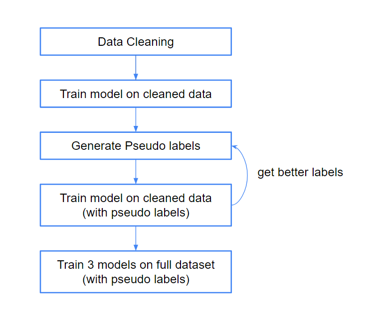
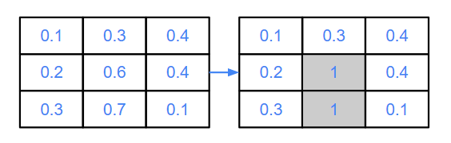
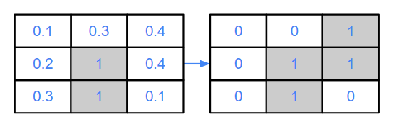
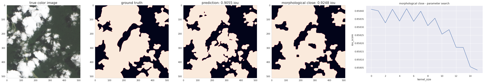
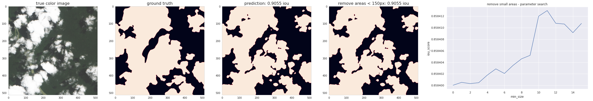
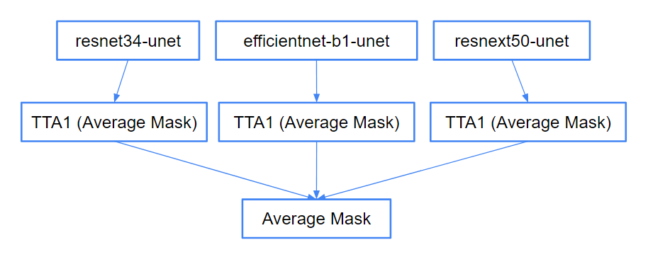

# Approach

## Data Cleaning process
1. Data cleaning
   * Removed inconsistent labels
   * Removed broken masks
   * Removed wrong masks (e.g. inverted masks, wrong masks...)
1. Trained segmentation model on clean data
2. Generated pseudo-labels for sample that got removed in step 1

## Models
* Used in final models:
  * 3x encoder-decoder models in ensemble:
    * Encoder: resnet34, decoder: unet
    * Encoder: efficientnet-b1, decoder: unet
    * Encoder: resnext50_32x4d, decoder: unet
* Tried out:
  * Encoder: resnet34, resnet50, resnet101, efficientnet-b4, xception, se_resnet50
  * Decoder: unet, FPN

## Loss function
* Used in final models:
  * Cross-Entropy Loss
* Tried out:
  * Binary Crossentropy Loss (worse performance)

## Optimizer
* Used in final models:
  * Adam
* Tried out:
  * Rectified Adam (worse performance)

## Learning Rate Scheduler: 
* Cosine Annealing LR

## Metric
* JaccardIndex (IOU)  

## Augmentations
* Used in final models:
  * Horizontal flip, vertical flip
* Tried out:
  * Copy&paste augmentation
  * ShiftScaleRotate
  * Random crop
  * Multi scale

## TTA
* Used in final models:
  * unfortunatly i only could use TTA1 (hlip) without over-extending the 4 hour submission time limit 
* Tried out:
  * TTA3 showed best performance (TTA3 = vflip, hflip, vflip+hflip)

## Post-Processing
* Used in final models:
  * none
* Tried:
  * Doublet scheme  
    * set min_score_threshold (e.g. 0.4) and top_score_threshold (e.g. 0.6)
    1. Determine if image contains clouds (values > top_score_threshold)
    
    1. Add values around the clouds borders, which are > min_score_threshold
    
  * Morphological close  
    source: [OpenCV](https://docs.opencv.org/3.4/d9/d61/tutorial_py_morphological_ops.html)
  
  * Morphological dilation  
    source: [OpenCV](https://docs.opencv.org/3.4/d9/d61/tutorial_py_morphological_ops.html)
  
  * Remove areas < 150px
  
  * Convex hull, approx. polygon shape, approx. rectangle shape  
  source: [Kaggle notebook](https://www.kaggle.com/ratthachat/cloud-convexhull-polygon-postprocessing-no-gpu?scriptVersionId=20977692)

## Inference Pipeline

* Inference on each model:
  * Make 2 predictions on each image:
    1. Prediction without aug. 
    2. Prediction after aug.
  * Take average of both predictions ((pred_1 + pred_2) / 2)
* Add each resulting mask of each model to each other and take the average of that ((model1_pred + model2_pred + model3_pred) / 3) 

## Lessons learned and future approaches
* Proper model validation is key for success
* Iterate faster to have more time for post-processing
* Try out convNext and SwinTransformer models
* Implement efficient TTA3 solution
* Find edge cases to use post-processing techniques mentioned above
* Iterate faster to have more time with post-processing & ensembling
* Teaming up 
