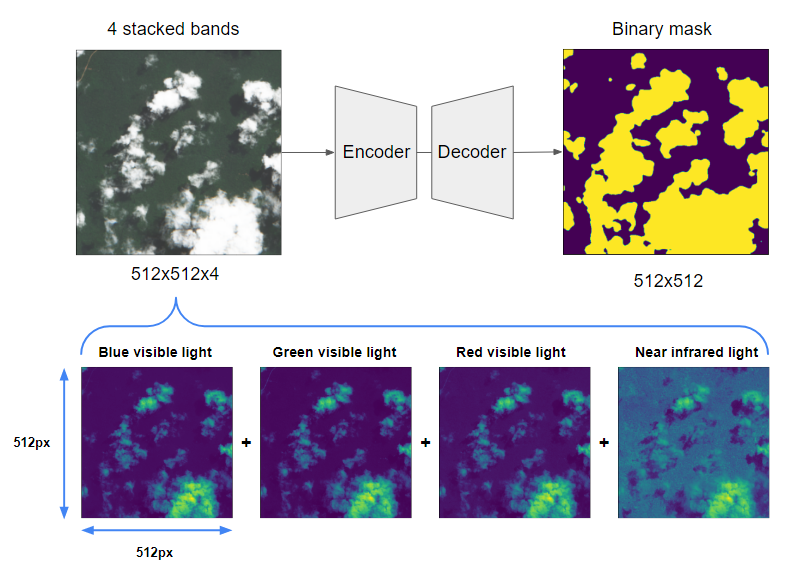

# On-Cloud-N: Cloud Detection Challange



## Info
* Last update: 29.04.2022
  * competition data is now available online: [ML Hub](https://mlhub.earth/data/ref_cloud_cover_detection_challenge_v1)
  * added download_competition_data script to run.ipynb
* Online-Demo: [Cloud Model Demo Repo](https://github.com/max-schaefer-dev/cloud-detection-demo)
* Make sure to to look at <code>APPROACH.md</code> for more details
* Model weights available at:
  * Model 1: [Resnet34-Unet-512-512.pt](https://drive.google.com/file/d/1uXuxV0j_9cI5oXcSw1mH1mSoPU6SWrYA/view?usp=sharing)
  * Model 2: [EfficientNetB1-Unet-512-512.pt](https://drive.google.com/file/d/1OBesw6cZOZcop-p1X0LHKqdEQy2sYc5n/view?usp=sharing)
  * Model 3: [Resnext50-Unet-512-512.pt](https://drive.google.com/file/d/15mL8c9OBPk2JIcPb0k6t_NMtH-mKeVWE/view?usp=sharing)


## Problem
* Statement: Detect clouds cover in satellite imagery to remove cloud inference
* Type: Semantic Segmentation
* Competition link: https://www.drivendata.org/competitions/83/cloud-cover/

## Hardware requirements
- Run on Google Colab Pro
- GPU (model or N/A): 1x Tesla P100 with 16GB 
- Memory (GB): 1x 168GB
 OS: Linux
- CPU RAM: 1x 16 GB
- CUDA Version : 11.2
- Driver Version: 460.32.03
- Disk: 128 GB

## Software requirements
Required software are listed on requirements.txt. Please install all the dependencies before executing the pipeline.

## How to run
You can check the run.ipynb notebook for the main point of entry to my code.

### Data preparation
First, the training and testing data should be downloaded from the competition website. Ideally, the data can be placed in the data folder in the repo directory. The repo tree would then look like below:

```
../on-cloud-n-19th-place-solution/
├── LICENSE.md
├── README.md
├── configs
│   ├── efficientnet-b1-unet-512.yaml
│   ├── resnext50_32x4d-unet-512.yaml
│   └── resnet34-unet-512.yaml
├── data
│   ├── train_features
│   │   ├── train_chip_id_1
│   │   │   ├── B02.tif
│   │   │   ├── B03.tif
│   │   │   ├── B04.tif
│   │   │   └── B08.tif
│   │   └── ...
│   ├── train_labels
│   │   ├── train_chip_id_1.tif
│   │   ├── ...
│   │   ...
│   ├── metadata_updated.csv
│   └── pseudo_labels.zip
...

```

### Training
Run train.py to train final 3 models using appropriate arguments.  
- **--cfg** config file path
- **--fast-dev-run** trains only with 1 batch of the entire files
- **--model-name** name of the model
- **--img-size** image size. e.g. --img-size 512 512
- **--batch-size** batch size
- **--loss** loss used for model
- **--scheduler** lr scheduler
- **--selected-folds** folds to train
- **--all-data** use all data for training. No validation data
- **--ds-path** dataset path
- **--output-dir** path to save model weights and necessary files


## Training Pipeline

```
!python train.py --fast-dev-run 1 --cfg './configs/resnet34-unet-512.yaml'
!python train.py --fast-dev-run 1 --cfg './configs/efficientnet-b1-unet-512.yaml'
!python train.py --fast-dev-run 1 --cfg './configs/resnext50_32x4d-unet-512.yaml'
```

## Prediction


Run predict.py in order to predict on test images.

### predict.py
- **--model-dir** the directory where the models listed in are located. The * complete model location is model-dir/*.pt.
- **--batch-size** batch size
- **--ensemble** ensemble mode (0 = off, 1 = on)
- **--fast-dev-run** predicts only with 1 batch of the entire files
- **--ds-path** path to dataset
- **--bands** bands used in model
- **--output-dir** output folder to to save generated .tif files
- **--tta** number of TTA's

#### **Inference without Training:**
First download the checkpoints mentioned in the info section above and place them on `./output` directory then run the following codes.
```
!python predict.py --ensemble 1 --tta 1 --batch-size 8
```

#### **Inference after Training:**
After training is done, run the following codes.
```
!python predict.py --ensemble 1 --tta 1 --batch-size 8
```

> Before predict, file tree would look like this:
```
../on-cloud-n-19th-place-solution/
...
├── data
│   ├── train_features
│   ├── train_labels
│   ├── test_features
│   └── train_metadata.csv
...
├── output
│    ├── resnet34-unet-512x512
│    │   ├── resnet34-unet-512.yaml
│    │   └── resnet34-unet.pt
│    ├── efficientnet-b1-unet-512x512
│    └── resnext50-unet-512x512
...
 
```
